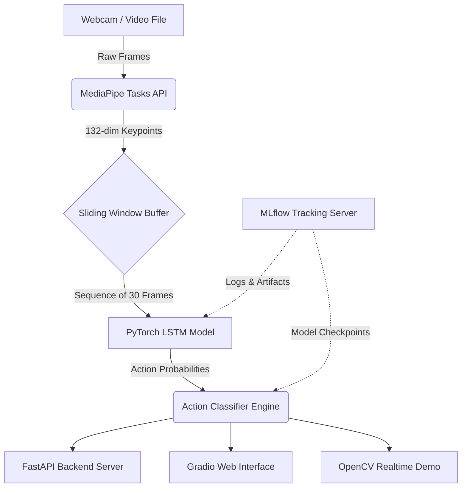

# Pose Action Recognition

A robust, real-time human action recognition system powered by MediaPipe pose estimation, a PyTorch LSTM sequence model, FastAPI, and Gradio.


## Overview

This project provides an end-to-end Machine Learning pipeline for real-time human action recognition. It extracts 3D skeletal keypoints from a continuous video stream using the modern **MediaPipe Tasks API**, processes them through a sliding window temporal buffer, and predicts the current action using a highly accurate **PyTorch LSTM model**. 

The system includes tools for custom data collection, model training with MLflow tracking, an invisible FastAPI inference backend, and interactive user interfaces (both web and desktop).

## Core Features
*   **Real-Time Pose Extraction:** Uses MediaPipe's robust `PoseLandmarker` for high-speed, lightweight skeletal tracking.
*   **Temporal Action Modeling:** A multi-layer LSTM model that understands the sequence and timing of movements over a 30-frame window.
*   **End-to-End Pipeline:** Includes a custom dataset collector, automated training loops, and inference engines.
*   **Dual Interfaces:** Test your model via a beautiful **Gradio Web App** or a low-latency **OpenCV Desktop Demo**.
*   **Production Ready:** Fully containerized backend using Docker and `uvicorn`.
*   **Experiment Tracking:** Built-in MLflow integration to log metrics, confusion matrices, and model artifacts.

---

## Architecture Diagram



---

## Actions Recognized

The model is pre-configured to classify the following 6 actions:

| Action | Description |
| :--- | :--- |
| **push_up** | Distinguishing motion in shoulders, elbows, and wrists moving up and down in a plank position. |
| **squat** | Distinguishing motion in hips, knees, and ankles with vertical body translation. |
| **wave** | Distinguishing repetitive side-to-side motion of an arm/wrist above shoulder level. |
| **jumping_jack** | Distinguishing synchronized outward and inward motion of both arms and legs. |
| **sitting** | Static downward compression of the lower body. |
| **idle** | Minimal to no distinguishing motion; standing still. |

---

## Tech Stack

| Layer | Tool | Purpose |
| :--- | :--- | :--- |
| **Pose Extraction** | MediaPipe | Extract 3D skeletal keypoints from video frames in real-time. |
| **Deep Learning** | PyTorch | Implement and train the LSTM sequence classification model. |
| **API Backend** | FastAPI | Serve the trained model via high-performance REST endpoints. |
| **Web UI** | Gradio | Provide a beautiful web interface for uploading and analyzing videos. |
| **Tracking** | MLflow | Track training runs, metrics, and download best model versions. |
| **Containerization**| Docker | Package the API server and MLflow tracking into portable containers. |

---

## Project Structure

```text
pose-action-recognition/
├── data/
│   └── sequences/              # Raw .npy keypoint sequence arrays
├── models/                     # Saved PyTorch artifacts (best_lstm.pt)
├── app/
│   ├── main.py                 # FastAPI application entrypoint
│   ├── inference.py            # Inference engine & ActionClassifier class
│   └── model.py                # PyTorch LSTM architecture definition
├── train/
│   ├── dataset.py              # PyTorch Dataset for loading sequence arrays
│   └── train.py                # Training loop, evaluation, and MLflow logging
├── data_collector.py           # Script to record webcam keypoints to disk
├── realtime_demo.py            # OpenCV live webcam inference demonstration
├── gradio_app.py               # Gradio web interface for video file analysis
├── mlflow_utils.py             # MLflow helper scripts (setup, download artifact)
├── requirements.txt            # Local/CPU Python dependencies
├── requirements_colab.txt      # Colab/GPU training dependencies
├── Dockerfile                  # Container definition for the FastAPI server
└── docker-compose.yml          # Orchestration for API and MLflow services
```

---

## Setup & Installation

### 1. Clone the repository
```bash
git clone https://github.com/anantha037/pose-action-recognition.git
cd pose-action-recognition
```

### 2. Create a Virtual Environment
```bash
python -m venv venv
# Windows
.\venv\Scripts\activate
# Linux/Mac
source venv/bin/activate
```

### 3. Install Dependencies
> **Hardware Note:** This installation specifically uses the **CPU-only** PyTorch wheel to save >2GB of local disk space, as CPU inference is exceptionally fast (<10ms per frame) for this architecture.
```bash
pip install -r requirements.txt
```

---

## User Guide

### 1. Show Off the Web App (Recommended)
Launch the beautiful, interactive web interface to upload action videos, adjust confidence thresholds, and generate annotated summaries.
```bash
python gradio_app.py
```
> Access at `http://localhost:7860`

### 2. Live Webcam Demo
Run inference locally against your live webcam feed using an OpenCV overlay.
```bash
python realtime_demo.py
```

### 3. Production API Server (Docker)
Run the backend server and MLflow tracking UI natively without polluting your host machine.
```bash
# Start all services
docker-compose up --build -d

# Check API health
curl http://localhost:8000/docs
```
> API available at `http://localhost:8000`
> MLflow dashboard available at `http://localhost:5000`

### 4. Collect Custom Data
Want to add a new action? Stand in front of your webcam and record sequences directly to disk.
```bash
python data_collector.py --action my_new_action --samples 50
```

### 5. Train the Model
Train the model locally or on Google Colab. Metrics are automatically logged to MLflow.
```bash
python train/train.py --epochs 60 --batch_size 32
```
To fetch the best model from a Colab MLflow run to your local machine:
```bash
python mlflow_utils.py --experiment pose-action-recognition --output_dir models
```

---

## Technical Notes & Compatibility

* **Python 3.13 & MediaPipe Compatibility:** The codebase leverages the modern `mediapipe.tasks.python.vision` API. The legacy `mediapipe.solutions` API is fundamentally broken on Python 3.13. This project entirely bypasses the legacy API, ensuring forward-compatibility with all modern Python 3 environments.
* **Performance:** The LSTM model contains roughly 500k parameters. When combined with MediaPipe's `Lite` landmarker, the entire pipeline operates comfortably at **30-60 FPS** on standard consumer CPUs (e.g., Intel i5), making GPU inference strictly optional.

## Author
**Anantha Krishnan**
- GitHub: [https://github.com/anantha037](https://github.com/anantha037)
